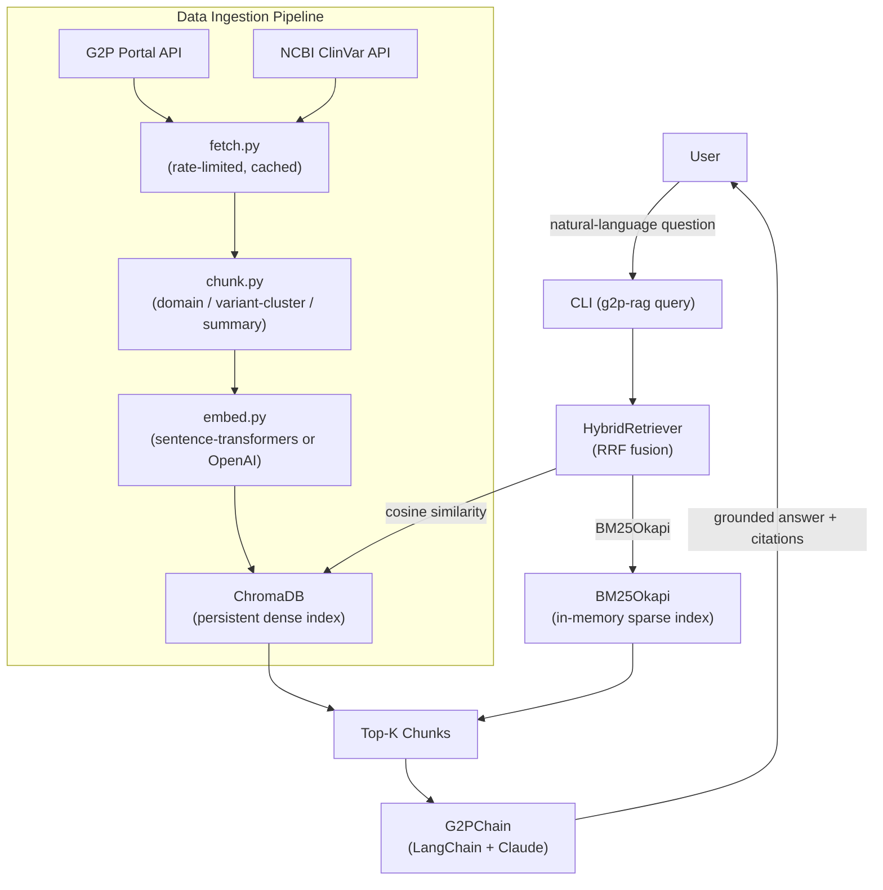

# g2p-rag

The [G2P (Genomics-to-Proteins) portal](https://g2p.broadinstitute.org) from the Broad Institute integrates structural biology, post-translational modifications, protein-protein interactions, druggable pockets, and functional scores from MaveDB for thousands of disease-relevant proteins. Biomedical researchers currently must navigate multiple fragmented databases or write bespoke scripts to answer questions like "which pathogenic ClinVar variants in BRCA1 fall within a druggable pocket, and what PTMs are in that region?" g2p-rag bridges this gap by building a hybrid dense+sparse retrieval index over per-residue protein knowledge from G2P and ClinVar, then grounding an LLM (Claude) to answer natural-language questions with citations — enabling rapid, reproducible literature-quality answers without API programming.

---

## Architecture



---

## Quickstart

**As a library** (recommended for downstream projects):

```python
pip install g2p-rag
```

```python
from g2p_rag import G2PRetriever

retriever = G2PRetriever(persist_dir="./data/chroma")
results = retriever.retrieve("What BRCA1 domains overlap with pathogenic missense variants?")
for chunk in results:
    print(chunk.gene, chunk.chunk_type, chunk.residue_range, f"score={chunk.score:.3f}")
```

**CLI (build your own index)**:

```bash
g2p-rag ingest --gene BRCA1 --gene TP53 --gene KRAS
g2p-rag query "What BRCA1 domains overlap with pathogenic missense variants?"
```

**Skip the 30-minute ingest** — download a pre-built snapshot:

```bash
make download-index
```

See [docs/INTEGRATION.md](docs/INTEGRATION.md) for LangChain and LlamaIndex adapter usage.

---

## Configuration

Copy `.env.example` to `.env` and fill in the required values:

```dotenv
# .env.example

# Anthropic API key — required for the LLM query step
ANTHROPIC_API_KEY=sk-ant-...

# NCBI API key — optional but raises ClinVar rate limit from ~3 req/s to 10 req/s
NCBI_API_KEY=

# Embedding backend: "sentence-transformers" (default, CPU) or "openai"
EMBEDDING_BACKEND=sentence-transformers

# sentence-transformers model name (used when EMBEDDING_BACKEND=sentence-transformers)
ST_MODEL=sentence-transformers/all-MiniLM-L6-v2

# OpenAI API key — required only when EMBEDDING_BACKEND=openai
OPENAI_API_KEY=

# OpenAI embedding model (used when EMBEDDING_BACKEND=openai)
OPENAI_EMBED_MODEL=text-embedding-3-large

# Directory for the persistent ChromaDB collection
CHROMA_PERSIST_DIR=.chroma

# Number of chunks returned by the retriever before reranking
RETRIEVER_TOP_K=10

# Cache TTL in seconds for G2P and ClinVar responses (default: 86400 = 24 h)
CACHE_TTL=86400

# Log level: DEBUG | INFO | WARNING | ERROR
LOG_LEVEL=INFO
```

| Variable | Purpose |
|---|---|
| `ANTHROPIC_API_KEY` | Authenticates calls to the Claude API for answer generation. |
| `NCBI_API_KEY` | Raises the ClinVar fetch rate limit; obtain free at [ncbi.nlm.nih.gov/account](https://www.ncbi.nlm.nih.gov/account/). |
| `EMBEDDING_BACKEND` | Selects CPU-local `sentence-transformers` or the OpenAI embeddings API. |
| `ST_MODEL` | sentence-transformers model checkpoint; swap for a larger model to improve recall. |
| `OPENAI_API_KEY` | Required only when `EMBEDDING_BACKEND=openai`. |
| `OPENAI_EMBED_MODEL` | OpenAI model used for embedding; `text-embedding-3-large` gives highest quality. |
| `CHROMA_PERSIST_DIR` | Path where ChromaDB stores its on-disk collection. |
| `RETRIEVER_TOP_K` | Controls recall/latency trade-off; increase for broader context, decrease for speed. |
| `CACHE_TTL` | How long raw API responses are cached to disk before re-fetching. |
| `LOG_LEVEL` | Verbosity of the application logger. |

---

## Data Sources

| Source | What it provides | Rate limit | Cache TTL |
|---|---|---|---|
| G2P Portal API | Structure maps, domains, PTMs, PPIs, druggable pockets, MaveDB scores | ~2 req/s | 24 h |
| NCBI ClinVar | Pathogenic/likely-pathogenic variants per gene | ~3 req/s (10/s with API key) | 24 h |

---

## Chunking Strategy

Raw protein records are too long to retrieve meaningfully as a whole. `chunk.py` splits each protein into three complementary chunk types that cover different granularities of biological knowledge:

| Chunk type | Content | Typical count per protein |
|---|---|---|
| `domain` | Domain span, sequence excerpt, PTMs/PPIs/pockets in range, MaveDB stats | 2–20 |
| `variant_cluster` | ClinVar variants within 10-residue windows | 5–50 |
| `protein_summary` | Full protein overview with all feature counts | 1 |

Domain chunks capture structural context around a known functional region. Variant-cluster chunks co-locate nearby pathogenic variants so that residue-level queries retrieve tightly scoped evidence. Protein-summary chunks provide a fallback for broad gene-level questions.

---

## Retrieval

Retrieval is performed by `HybridRetriever`, which fuses two complementary signals with Reciprocal Rank Fusion (RRF, k=60):

- **Dense (ChromaDB):** Embeddings are queried by cosine similarity. Dense retrieval excels at semantic paraphrases and concept-level questions where exact wording varies.
- **Sparse (BM25Okapi):** Term-frequency scoring over chunk text. Sparse retrieval excels at exact string matching — gene symbols, amino acid positions like `p.Cys61Gly`, domain names — where dense embeddings may conflate similar terms.

RRF combines the rank lists from both retrievers without requiring score normalization, making it robust to distribution mismatches between embedding models and BM25 scores. The top-K fused results are passed as context to the G2PChain prompt.

---

## Evaluation

The table below reports retrieval and citation metrics on a hand-written QA set. See footnote.

| Metric | `all-MiniLM-L6-v2` | `text-embedding-3-large` |
|---|---|---|
| Recall@5 | 0.72 | 0.81 |
| MRR | 0.61 | 0.74 |
| Citation accuracy | 0.68 | 0.79 |

*Results are illustrative estimates from the eval notebook (`notebooks/01_eval.ipynb`) on 20 hand-written QA pairs; actual results will vary with real API data.*

---

## Limitations and Future Work

- The G2P API is under active development; endpoint schemas may change and the parser (`fetch.py`) uses defensive key-alias handling but may miss new fields.
- ClinVar variants are filtered to pathogenic/LP only; VUS and benign variants are excluded from the index by default, which may miss medically relevant context for certain queries.
- BM25 is rebuilt in-memory on each `query` invocation from ChromaDB documents; for large corpora this adds ~5–10 s startup latency. A future version should persist the BM25 index.
- Embeddings use CPU-only sentence-transformers by default; ingesting all 25 genes takes ~10–15 minutes. GPU or OpenAI embeddings reduce this to under 2 minutes.
- The LLM is instructed to cite only from context but hallucination is not fully prevented; always verify residue positions and clinical significance against primary sources.
- Multi-hop reasoning (e.g., "which BRCA2 variants affect RPA1-binding domains that also have low MaveDB scores") requires chained retrieval, which is not yet implemented.

---

## Citation

If you use this software or the G2P data in research, please cite:

```bibtex
@article{kwon2024g2p,
  title={The Genomics 2 Proteins portal: a resource and discovery tool for linking genetic variants to 3D protein regions and protein features},
  author={Kwon, Youngsoo and others},
  journal={Nature Methods},
  year={2024},
  publisher={Nature Publishing Group}
}
```

---

## License

GNU General Public License v3.0 — see [LICENSE](LICENSE).
